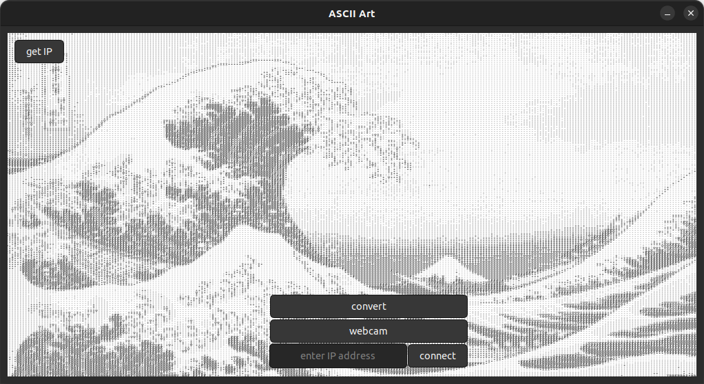
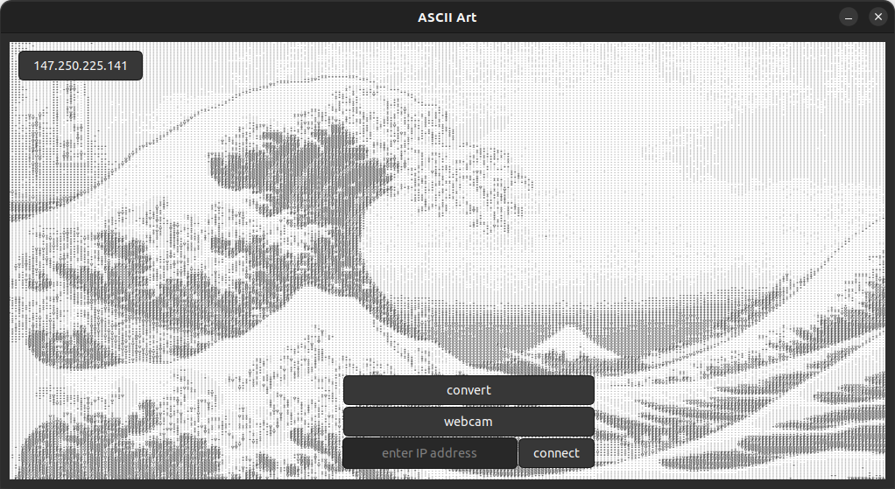
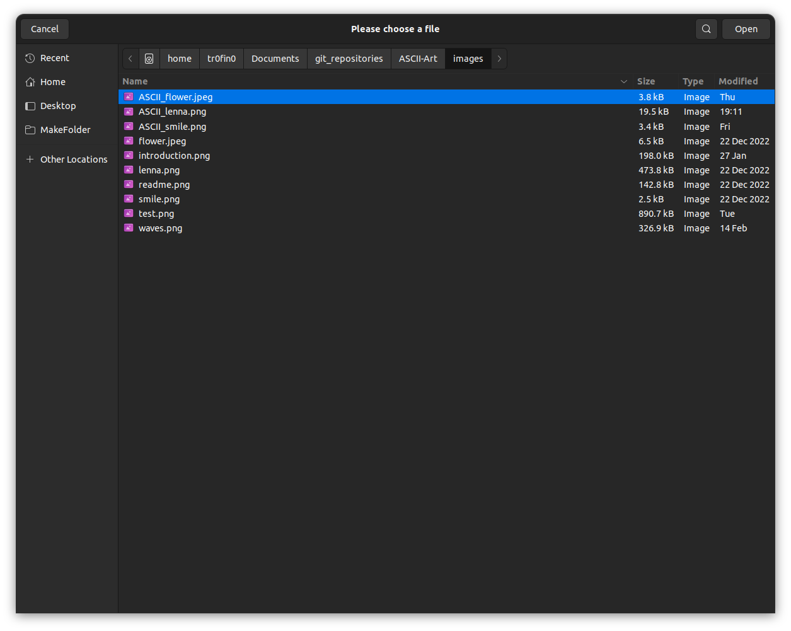
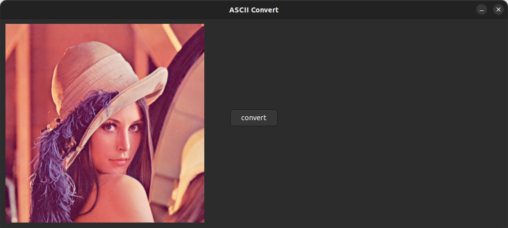
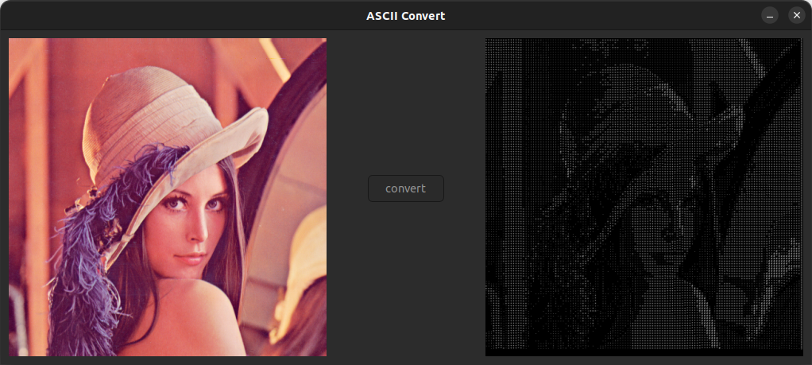
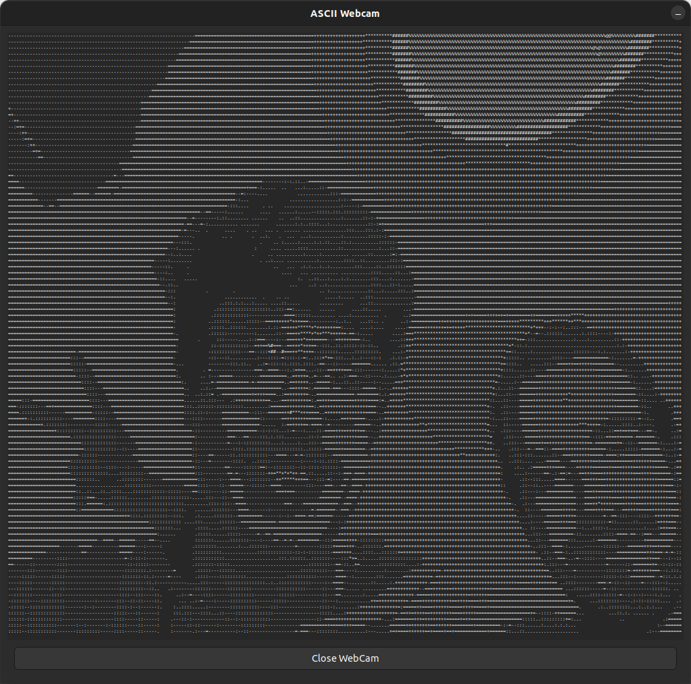
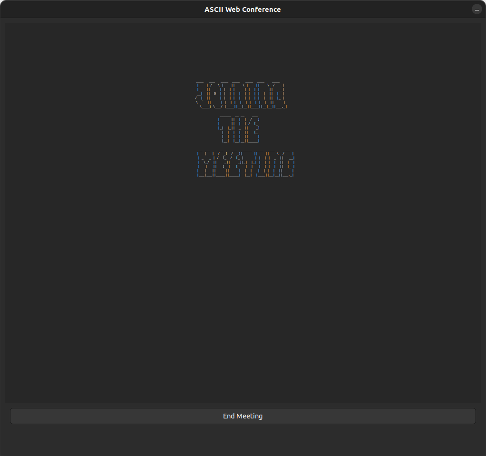
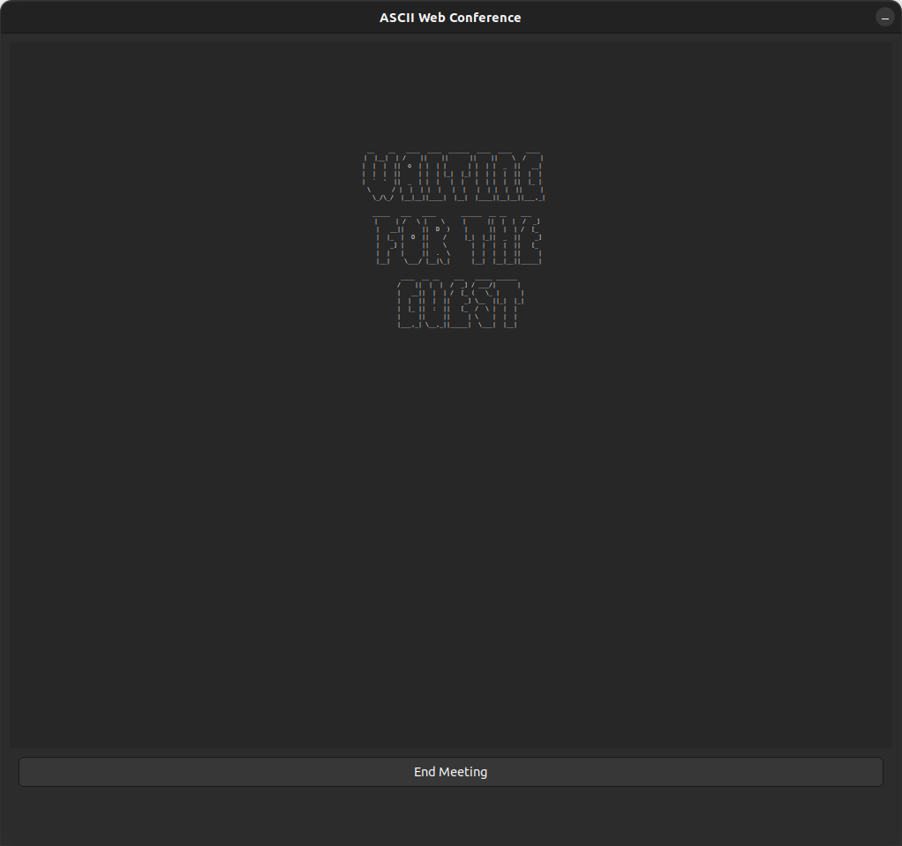

# ASCII Art Generator


## Description
The project wants to generate ASCII Art from different inputs with C++ by using [OpenCV Library](https://opencv.org/).


## Installation
### VSCode
Project was developed in Ubuntu 20.04 and 22.04 using [VSCode](https://code.visualstudio.com/docs/setup/linux) which we strongly recommend and can be installed as follows with [snap](https://snapcraft.io/):
```bash
sudo snap install --classic code
```

### Git
As the code was developed in four hands we used [Git](https://git-scm.com/) as our distributed version control system and the project was stored in [GitHub](https://github.com/tr0fin0/ASCII-Art).

Choose a file where you want to store the project and clone it with the following commands:
```bash
sudo apt-get install git-all

git clone https://github.com/tr0fin0/ASCII-Art.git
```

### SFML
[SFML](https://www.sfml-dev.org/) provides a simple interface to the various components of your PC, to ease the development of games and multimedia applications. It is composed of five modules: system, window, graphics, audio and network.
```bash
sudo apt-get install libsfml-dev
```


### OpenCV
The project was developed in Ubuntu. Following the [install OpenCV](https://docs.opencv.org/4.x/d7/d9f/tutorial_linux_install.html) documentation, open a terminal (`shift + alt + t`) and type the following:
```bash
sudo apt update
```

#### Dependence's
```bash
sudo apt install git
sudo apt install -y g++

sudo apt install -y cmake
sudo apt install -y make
```

#### Download Sources
Navegate to the `home/` folder and type:
```bash
git clone https://github.com/opencv/opencv.git
git -C opencv checkout 4.x
```
#### Configure and Build
In the `home/` folder type:
```bash
mkdir -p build && cd build
cmake ../opencv

make -j4
```
`-j4` means that the OpenCV library will be compile using 4 cores. During installation `-j8`, using 8 cores, was tried and it took longer to compile, therefore we recommend to stay with the 4 cores option.

#### Install
Finally type the following command to install the OpenCV library:
```bash
sudo make install
```

### GTK
`GTK 4.0` and `GTKmm 3.0` were used for the project's GUI. Open a terminal and type:
```bash
sudo apt update
```
```bash
sudo apt install libgtk-4-dev
sudo apt install libgtkmm-3.0-dev
```

### Other Dependencies
During the development two other libraries were used to convert `ASCII` encoding into `UTF8`:
```bash
sudo apt-get install dbus-x11
sudo apt-get install --reinstall dconf-gsettings-backend dconf-service
sudo apt-get install libuchardet-dev
```

## Running code
In ASCII-ART directory type `make` on a terminal window. 


## Usage
### `MainWindow`
After completing `make` the `MainWindow` will open:


Pressing the `getIP` button will set the text on the button to your machine's IP address.

*Note*: if you are using cabled internet there will be 2 IP address and the project **will not be able** to choose the correct address. Therefore the projet is intended to be used on **Wi-Fi connection only**.


Pressing the `convert` button will open the following dialog window for the user to select her/his desired image file.

*Note*: if the extension of the file chosen is not supported the window will convert nothing.
### `ConvertFile`


After choosing a valid input the `ConvertFile` window will display the selected image scaling it to fit the avaleable space on the window.

*Note*: images too small or to big may be distorted while scaling.


After pressing the `convert` button on the `ConvertFile` window a preview of the image in ASCII Art will be displayed and a PNG file will be saved on the same folder as the selected file.

*Note*: after converting this window won't have any purpose and may be closed.

### `Webcam`
After pressing the `webcam` button on the `MainWindow` the following window will be displayed showing the computer's webcam converted to ASCII Art as shown:

*Note*: great for photos.



### `Conference`
Finally there will be the `entryIP` entry and the `connect` button there will be used to connect two computers on the same network to one and other to exchange webcam video converted in ASCII Art.

If no address is given as entry, entry empty, and `connect` is pressed, this computer will be consider as host of the communication and will wait for a client to start the conversation.

If the same IP address of this computer is given as entry and `connect` is pressed, this computer will be consider as a host of the communication and will wait for a client to start the conversation.

If another valid IP addres is given as entry, in the form of "147.250.110.110", and `connect` is pressed, this computer will be consider as a client of the comunication and will connect with host that has the same IP address given as entry.


When the computer is the client the following screen will be shown:


When the computer is the host the following screen will be shown:

*Note*: as threads are used for communication the quit button was removed from the windows to make sure that the threads will be killed after the `end meeting` button press.


## Roadmap
This project had incremental goals:
1. Open a file in:
   - PNG;
   - JPG;
   - JPEG;

   converting into an ASCII Art and saving in PNG;

2. Use real-time input from the computer's webcam;

3. Video Conference between 2 computers in ASCII;

## Authors and Acknowledment
- Guilherme TROFINO:
  - [ LinkedIn](https://www.linkedin.com/in/guilherme-trofino/)
  - [ GitHub](https://github.com/tr0fin0)
- Gustavo JODAR:
  - [ LinkedIn](https://www.linkedin.com/in/gustavo-jodar/)
  - [ GitHub](https://github.com/Gustavo-Jodar)

We greatly appreciate our [IN204](https://synapses.ensta-paris.fr/catalogue/2020-2021/ue/3722/IN204-oriente-objet-programmation-et-genie-logiciel?from=D2) teachers at [ENSTA](https://www.ensta-paris.fr/):
- Bruno Monsuez
- Jean-Baptiste Laurent

More information in the [webpage](https://perso.ensta-paris.fr/~bmonsuez/Cours/doku.php?id=in204).